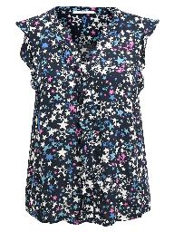
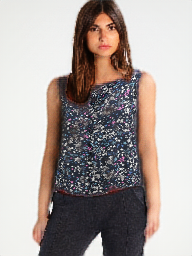

# [SmartFit](https://docs.google.com/presentation/d/146ZfU9597FB8AG4J9jFxlkXjaEJga5XEbI_EbsG0Jxw/present#slide=id.gc6f80d1ff_0_0)
### A virtual fitting room service for e-commerce!

<p float="left">
  
   
   
</p>

* [Important Note](#important-note)
* [Requisites](#requisites)
* [Setup](#setup)
  * [Test Example](#test-example)
* [Notebooks](#notebooks)
* [References](#references)

## Important Note

This repository is for demo purposes only and runs a publicly available clothing transfer model, which does not include all improvements. Correspondingly, some functionality may be missing.
  
## Requisites

* [Conda](https://conda.io/docs/user-guide/install/index.html)
* [Octave 4.2+](https://www.gnu.org/software/octave/download.html) (with [image](https://octave.sourceforge.io/image/index.html) package)
  * Also compatible with MATLAB

## Setup

First clone the repository:
```
git clone https://github.com/RohanBhandari/SmartFit.git
cd SmartFit
```

Next, run `source setup.sh`, which will create a conda environment and install the required packages via
```
conda create --name smartfit python=2.7 pip
source activate smartfit
pip install -r requirements.txt
```
Additionally, `setup.sh` will clone and setup auxiliary repositories that do the [human parsing](https://github.com/RohanBhandari/LIP_JPPNet.git), [pose estimation](https://github.com/RohanBhandari/keras_Realtime_Multi-Person_Pose_Estimation), and [clothing transfer](https://github.com/RohanBhandari/VITON/tree/f8427292e653df9ecb09a1413cfc4e0575a34469) steps. This process will download pre-trained models for each of the tasks.

### Test Example

To test whether the setup was successful, run the following command that should reproduce the clothing transfer shown at the top of the README:
```
./run_smartfit.sh inputs/example_person.jpg inputs/example_clothing.jpg
```
The corresponding output is `output/output.png` and should be similar to `output/example_output.png` (the right-most image above).

## Notebooks

This repo includes some jupyter notebooks (located in `notebooks/`) that may be useful for understanding the SmartFit pipeline and its inputs/outputs. Exact usage instructions are at the top of each notebook.

* `visualize_inputs.ipynb`
  * Explains and shows the main inputs to the clothing transfer model: body mask, face and pants, keypoint pose map, and clothing item.
* `visualize_output.ipynb`
  * Displays the output image.
* `skintone_check.ipynb`
  * Describes how the skintone check works. This is a check to make sure that the clothing transfer model did not change the skintone of the inputted person.

## References

This project builds from the work listed below:

* Human parsing
  * LIP_JPPNet ([repo](https://github.com/Engineering-Course/LIP_JPPNet), [paper](https://arxiv.org/abs/1804.01984))
* Pose estimation
  * Realtime Multi-Person Pose Estimation ([repo](https://github.com/ZheC/Realtime_Multi-Person_Pose_Estimation), [paper](https://arxiv.org/abs/1611.08050))
    * [Keras implementation](https://github.com/michalfaber/keras_Realtime_Multi-Person_Pose_Estimation)
* Virtual try-on
  * VITON ([repo](https://github.com/xthan/VITON), [paper](https://arxiv.org/abs/1711.08447))
